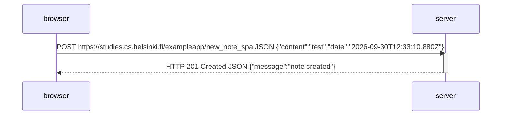

```mermaid
sequenceDiagram
    participant browser
    participant server

    browser->>server: POST https://studies.cs.helsinki.fi/exampleapp/new_note_spa JSON {"content":"test","date":"2026-09-30T12:33:10.880Z"}
    activate server
    server-->>browser: HTTP 201 Created JSON {"message":"note created"}
    deactivate server
```